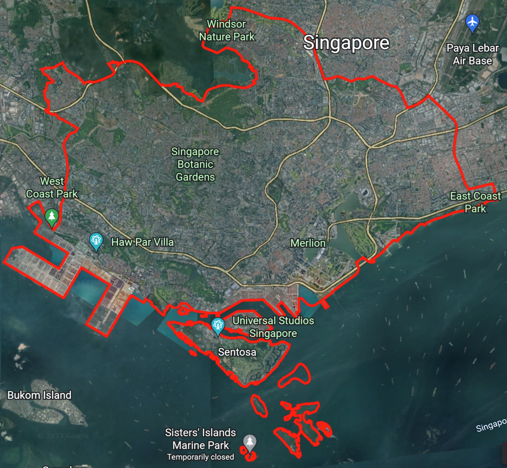
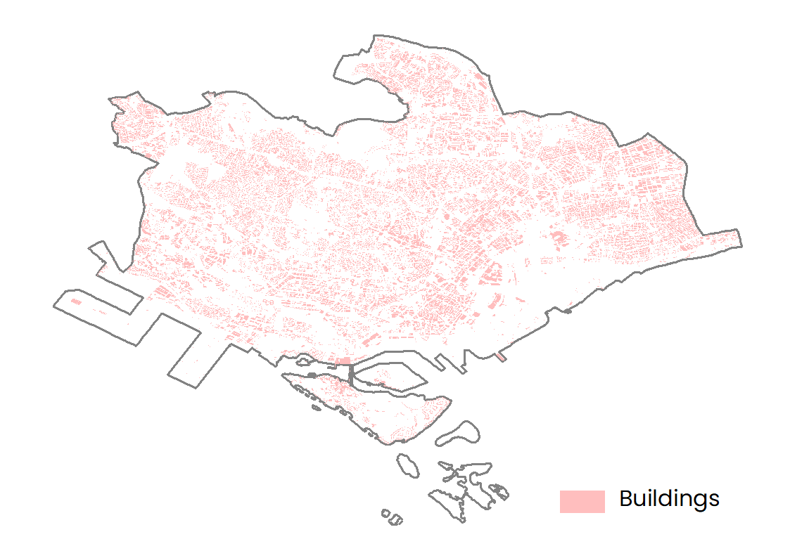
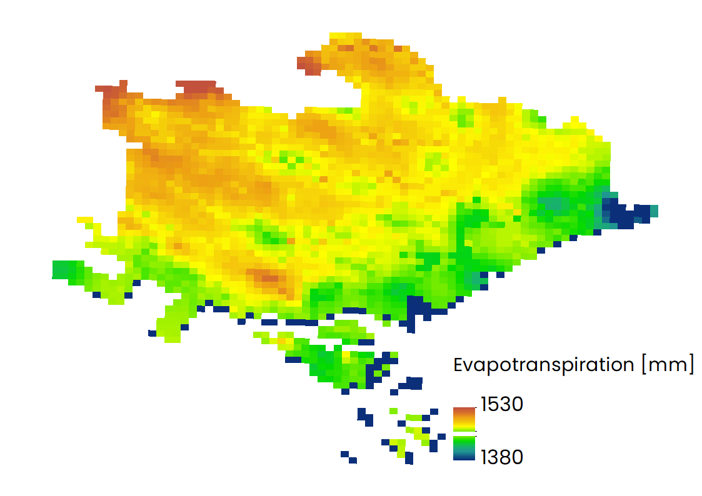
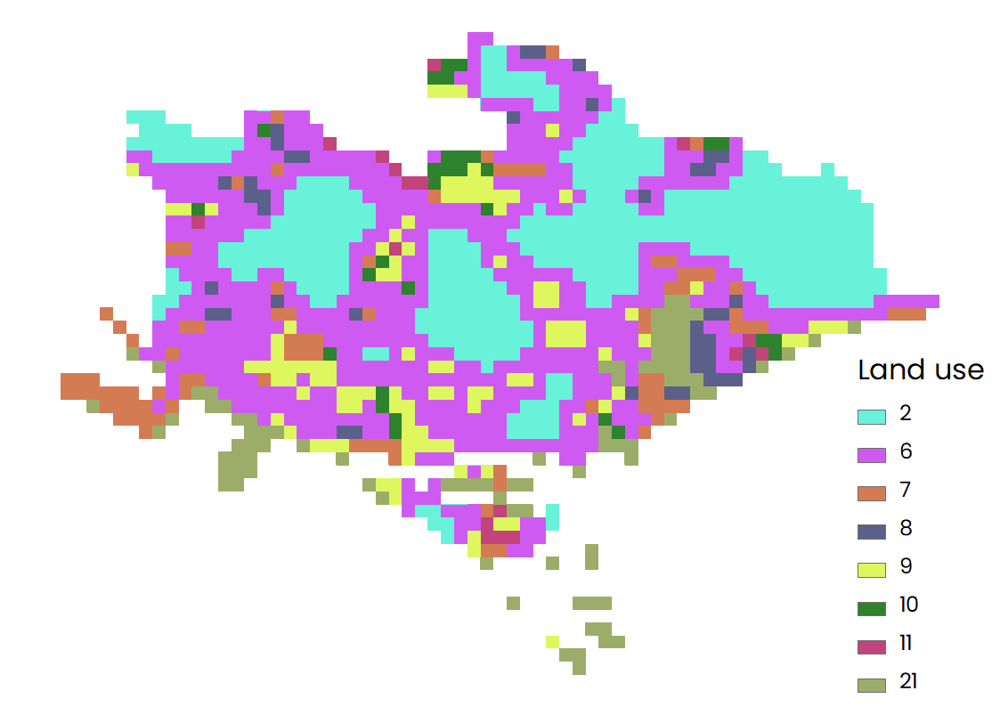

## Key Data

### List

- Work space:
- Land Use/Land Cover:
- Area of Interest:
- Evapotranspiration:
- Area of Interest:
- Biophysical Table:
- Reference Air Temperature (°C) : 30
- UHI Effect (°C) : 3.5
- Air Blending Distance (m) : 500
- Maximum Cooling Distance (m) : 450
- Cooling Capacity Calculation Method: factors
- Run Energy Savings Valuation: Yes
- Buildings:
- Energy Consumption Table:
- Run Work Productivity Valuation:
- Average Relative Humidity: 80
- Shade Weight (optional) : 0.6
- Albedo Weight (optional) : 0.2
- Evapotranspiration Weight (optional) : 0.2
### Input files
|| 
|:--:|
| Location of area of interest. |

||
|:--:|
| Distribution of buildings. |

||
|:--:|
| Distribution of evapotranspiration. |

||
|:--:|
| Distribution of land use type. |
