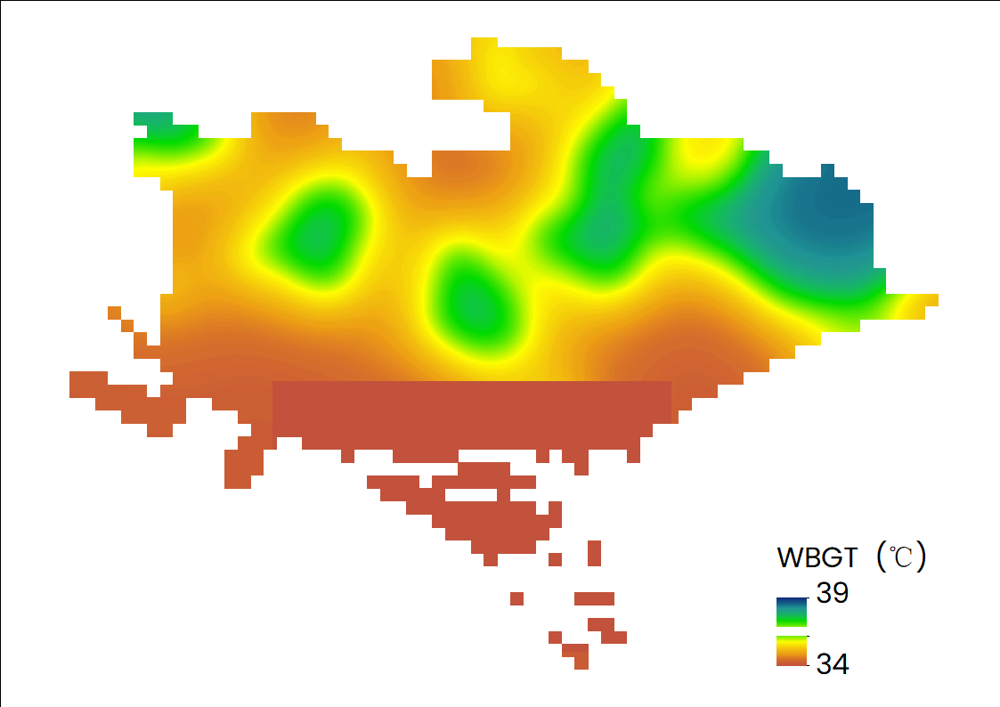
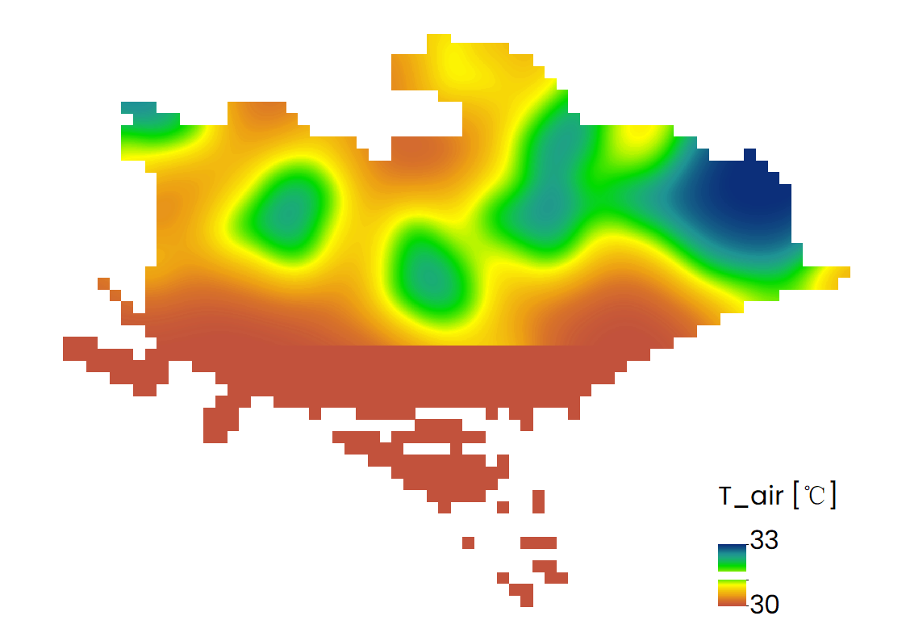
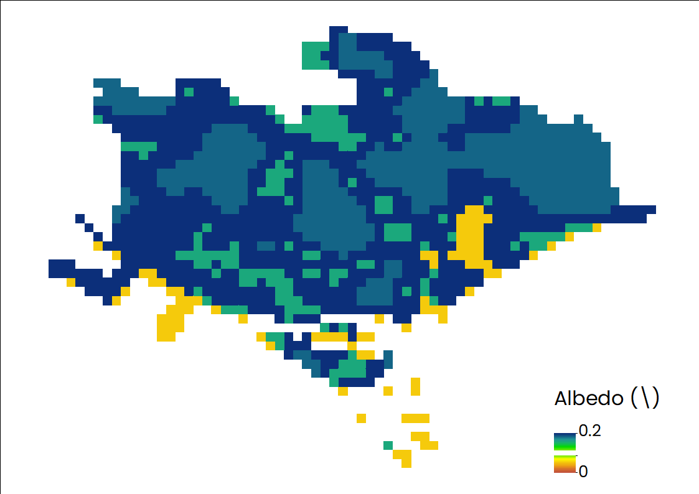
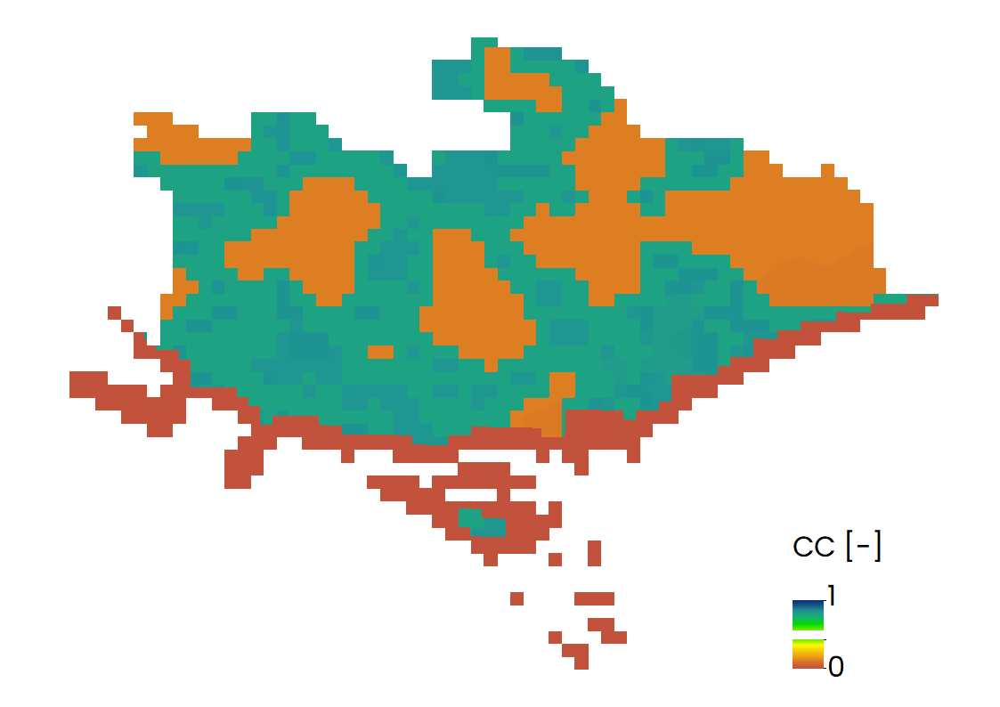
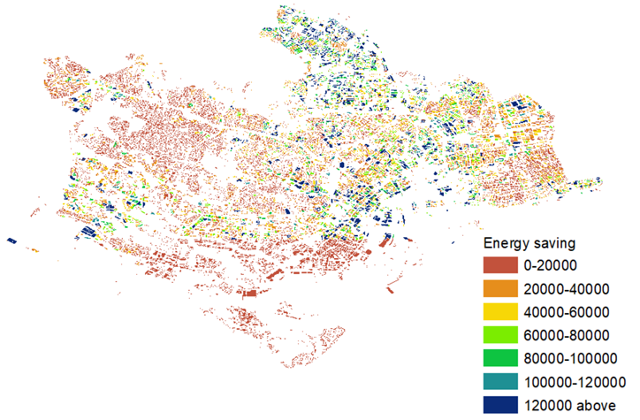

## Introduction

- The InVEST Urban Cooling Model calculates an index of heat mitigation based on evapotranspiration, shade and albedo, as well as distance from cooling islands (e.g. parks). The index is used to estimate a temperature reduction by vegetation [(source)](https://invest-userguide.readthedocs.io/en/latest/urban_cooling_model.html).

## Prerequisites

- Before running the module of Urban Cooling Model, you need to collect all necessary data, which has been listed in the [part of Data Requirement](https://xiaoganghe.github.io/InVEST-Cities-in-Nature/docs/Urban-Cooling/data/).

## Contents

1. [How do modules work?](#how-do-modules-work)
2. [Frequently asked questions](#frequently-asked-questions)

### How do modules work?

- Step 1: Running the model using all materials listed in the part of data requirement.  
  

- Step 2: The results of urban cooling model are described as the following figures. According to these figures, we can find that there exist some regions whose WBGT and T_air are clearly higher than their surrounding regions especially in urban districts (refer to [the distribution of land use type](https://xiaoganghe.github.io/InVEST-Cities-in-Nature/docs/Urban-Cooling/data/)). More insights into the energy savings should further take the distribution of buidings into consideration.

| |
|:--:|
| Distribution of Wet Bulb Globe Temperature (WBGT). |

| |
|:--:|
| Distribution of air temperature (T_air). |

| |
|:--:|
| Distribution of albedo. |

| |
|:--:|
| Distribution of cooling capacity (CC). |

| |
|:--:|
| Distribution of energy saving. |

### Frequently Asked Questions
1. What’s evapotranspiration and how to download this variable?  
   Evapotranspiration includes water evaporation into the atmosphere from the soil surface, evaporation from the capillary fringe of the groundwater table, and evaporation from water bodies on land ([source](https://www.usgs.gov/)). In this part, the evapotranspiration estimates provided by Simone are used for the period July 2012 to December 2016.  
   
## Glossary
| Variable              | Abbreviation       | Meaning             | Type  |
| :-------------------- | :------------------| :------------------ | :---: |
| Cooling capacity      | CC                 | An important factor for heat reduction                 | Output |
| Albedo                | /                  | The proportion of solar radiation that is directly reflected by this LULC class. Required if the ‘factors’ option is selected for the Cooling Capacity Calculation Method                 | Output |
| Wet Bulb Globe Temperature| WBGT           | WBGT can calculate the impacts of heat on work productivity| Output |
| Air temperature values| T_air              | Average air temperatures                 | Output |  

To know more about InVEST, please watch the following video:

