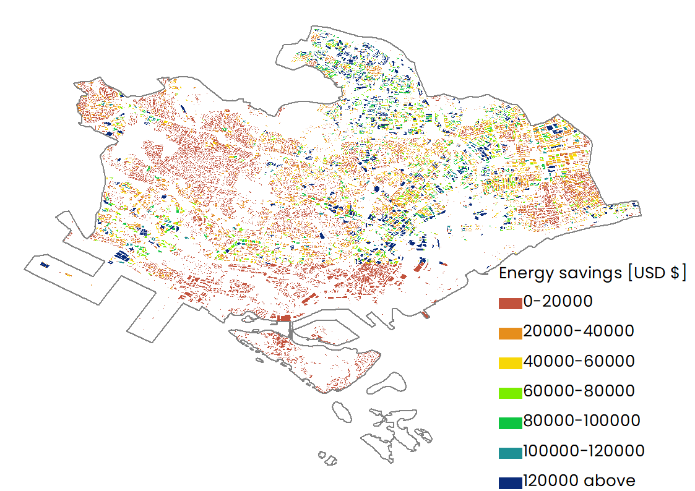

## Introduction

- The InVEST Urban Cooling Model calculates an index of heat mitigation based on evapotranspiration, shade and albedo, as well as distance from cooling islands (e.g. parks). The index is used to estimate a temperature reduction by vegetation [(source)](https://invest-userguide.readthedocs.io/en/latest/urban_cooling_model.html).

## Prerequisites

- Before running the module of Urban Cooling Model, you need to collect all necessary data, which has been listed in the [part of Data Requirement](https://xiaoganghe.github.io/InVEST-Cities-in-Nature/docs/Urban-Cooling/data/).

## Contents

1. [How do modules work?](#how-do-modules-work)
2. [Frequently asked questions](#frequently-asked-questions)

### How does the model work?
Add a video here.

or some texts.

### How to run the model?

- Step 1: Running the model using all materials listed in the part of data requirement.  
  

- Step 2: The results of urban cooling model are described as the following figures. According to these figures, we can find that there exist some regions whose WBGT and T_air are clearly higher than their surrounding regions especially in urban districts (refer to [the distribution of land use type](https://xiaoganghe.github.io/InVEST-Cities-in-Nature/docs/Urban-Cooling/data/)). More insights into the energy savings should further take the distribution of buidings into consideration.

## Model Output Layout

InVEST Urban Cooling model outputs have the following layout:

```
.
├── build/
│   ├── appicon.png
│   ├── darwin/
│   └── windows/
├── frontend/
├── go.mod
├── go.sum
├── main.go
└── wails.json
```

### Structure rundown

- `/main.go` - The main application
- `/frontend/` - Frontend project files
- `/build/` - Project build directory
- `/build/appicon.png` - The application icon
- `/build/darwin/` - Mac specific project files
- `/build/windows/` - Windows specific project files
- `/wails.json` - The project configuration
- `/go.mod` - Go module file
- `/go.sum` - Go module checksum file

The `frontend` directory has nothing specific to Wails and can be any frontend project of your choosing.

The `build` directory is used during the build process. These files may be updated to customise your builds. If
files are removed from the build directory, default versions will be regenerated.

The default module name in `go.mod` is "changeme". You should change this to something more appropriate.

### Another title
| |
|:--:|
| Distribution of Wet Bulb Globe Temperature (WBGT). |

| |
|:--:|
| Distribution of air temperature (T_air). |

| |
|:--:|
| Distribution of albedo. |

| |
|:--:|
| Distribution of cooling capacity (CC). |

| |
|:--:|
| Distribution of energy savings. |


## Glossary
| Variable              | Abbreviation       | Meaning             | Type  |
| :-------------------- | :-----------------:| :------------------ | :---: |
| Cooling capacity      | CC                 | An important factor for heat reduction                 | Output |
| Albedo                | \                  | The proportion of solar radiation that is directly reflected by this LULC class. Required if the ‘factors’ option is selected for the Cooling Capacity Calculation Method                 | Output |
| Wet Bulb Globe Temperature| WBGT           | WBGT can calculate the impacts of heat on work productivity| Output |
| Air temperature       | T_air              | Average air temperatures                 | Output |  
| [Energy savings](https://storage.googleapis.com/releases.naturalcapitalproject.org/invest-userguide/latest/urban_cooling_model.html#data-needs)| \              | the model uses a relationship between energy consumption and temperature (e.g. summarized by Santamouris et al. 2015) to calculate energy savings and associated costs for a building                 | Output |  

## Related references
- Hamel P, Guerry AD, Polasky S, Han B, Douglass JA, Hamann M, Janke B, Kuiper JJ, Levrel H, Liu H, Lonsdorf E. Mapping the benefits of nature in cities with the InVEST software. Npj Urban Sustainability. 2021 Jun 21;1(1):1-9. https://www.nature.com/articles/s42949-021-00027-9.  
- Zawadzka JE, Harris JA, Corstanje R. Assessment of heat mitigation capacity of urban greenspaces with the use of InVEST urban cooling model, verified with day-time land surface temperature data. Landscape and Urban Planning. 2021 Oct 1;214:104163. https://doi.org/10.1016/j.landurbplan.2021.104163.  
- Veerkamp CJ, Loreti M, Benavidez R, Jackson B, Schipper AM. Comparing three spatial modeling tools for assessing urban ecosystem services. Ecosystem Services. 2023 Feb 1;59:101500. https://doi.org/10.1016/j.ecoser.2022.101500. 


To know more about InVEST, please watch the following video:

[](https://www.youtube.com/watch?v=kGau-gNEzFM&t=1s)
