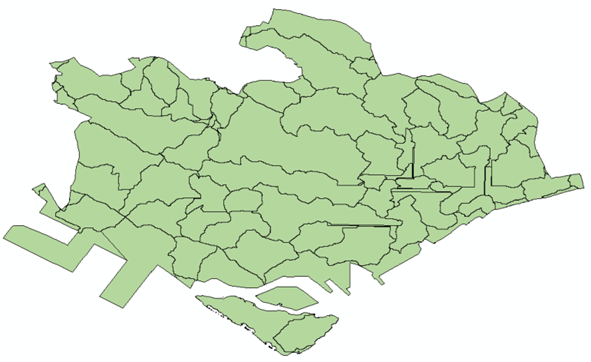
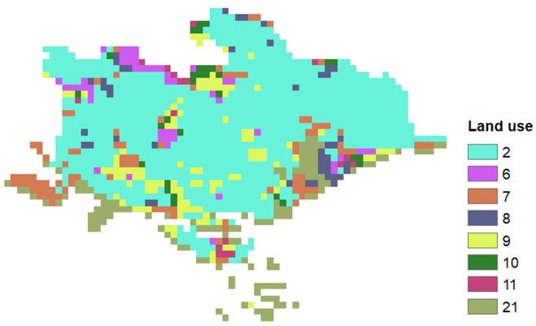
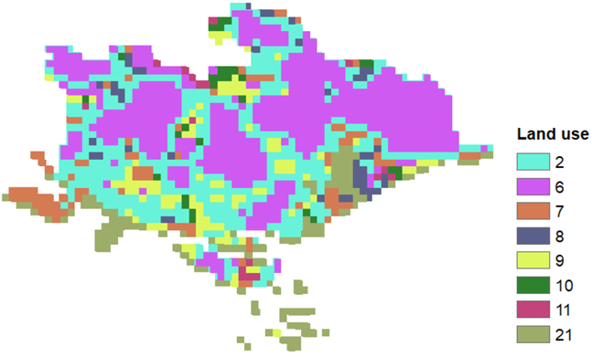
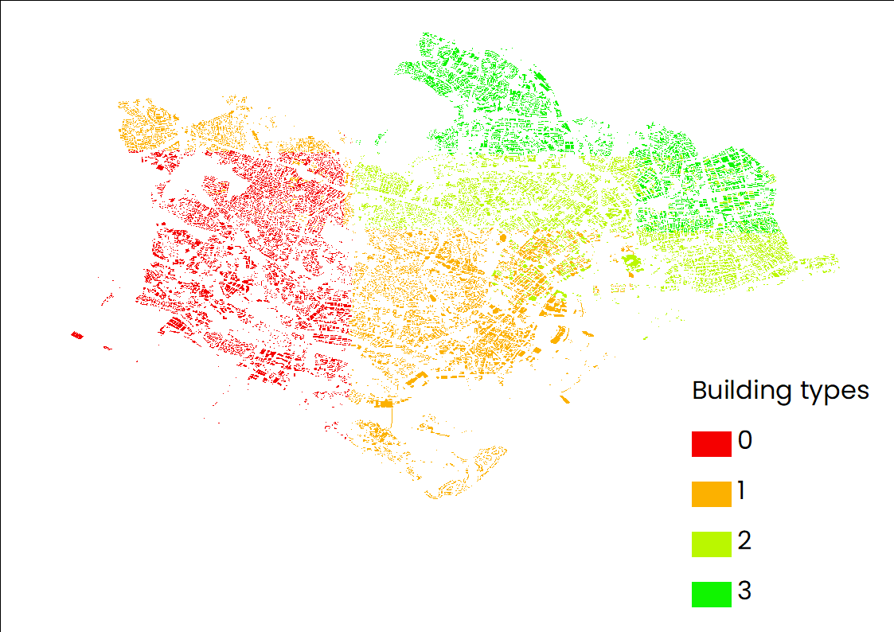
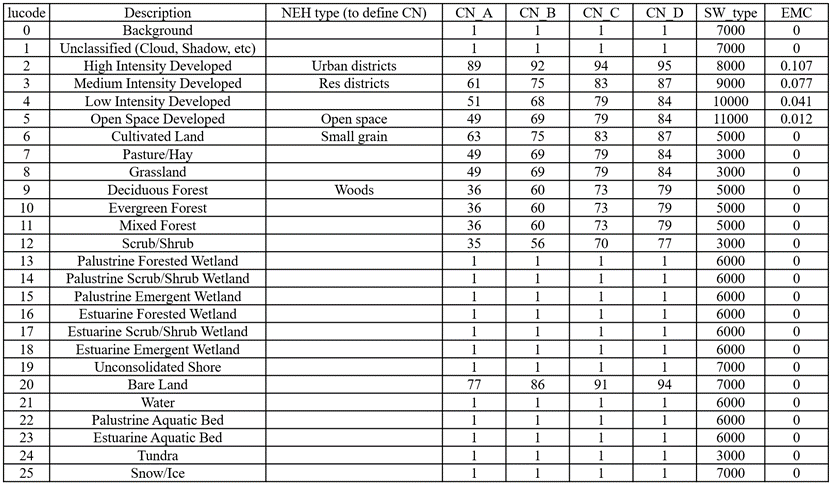
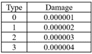
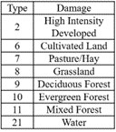

## Key Data

### List

- Workspace: 
- Area of interest: 
- Rainfall Depth (mm): 30 (or 100) 
- Land Use/ Land Cover: 
- Biophysical Table: 
- Soil Hydrologic Group:
- Built Infrastructure (optional):
- Damage Loss Table:

### Input files

||
|:--:|
| Distribution of all watersheds included in the area of interest. |

||
|:--:|
| Distribution of land use at present. |

||
|:--:|
| Distribution of land use after change. |

||
|:--:|
| Distribution of soil types. |

||
|:--:|
| Distribution of built infrastructure. |

||
|:--:|
| Detailed information about biophysical table. |

||
|:--:|
| Detailed information about damage loss table. |

||
|:--:|
| Detailed information about land use table. |

### Other Considerations

- (1) Different rainfall scenarios
  A total of two differnetn rainfall scenarios including 1) rainfall=100 mm and 2) rainfall= 30 mm have been designed in this study. 
- (2) The influence of land use change
  A total of two differnetn land use scenarios including 1) land use at present and 2) land use after change have been designed in this study. 
