:::info

This page is incomplete and we would love your help. Edit this page and add anything that would be helpful to others.

:::

InVEST is xxx.

## Introduction

The InVEST Urban Flood Risk Mitigation Model calculates the runoff reduction, i.e. the amount of runoff retained per pixel compared to the storm volume. For each watershed, it also calculates the potential economic damage by overlaying information on flood extent potential and built infrastructure. ([source](https://investuserguide.readthedocs.io/en/latest/urban_flood_mitigation.html).)

## Prerequisites

Before running the module of urban flood risk mitigation model, you need to collect all necessary data, which has been listed in the [part of Data Requirement](https://xiaoganghe.github.io/InVEST-Cities-in-Nature/docs/Flood-Risk-Mitigation/data).

## Contents

1. [How do modules work?](#how-do-modules-work)
2. [Frequently asked questions](#frequently-asked-questions)

## How do modules work?

Step 1: Running the model using all materials listed in the part of Data requirement  
  

Step 2: Rainfall=30 mm  

|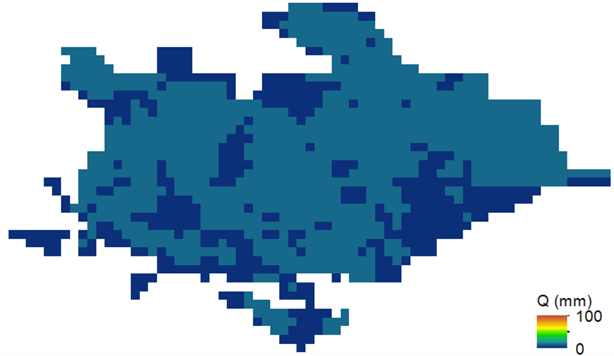 |
|:--:|
| Distribution of runoff values (Q) values when rainfall=30 mm. |

| |
|:--:|
| Distribution of runoff rention when rainfall=30 mm. |

|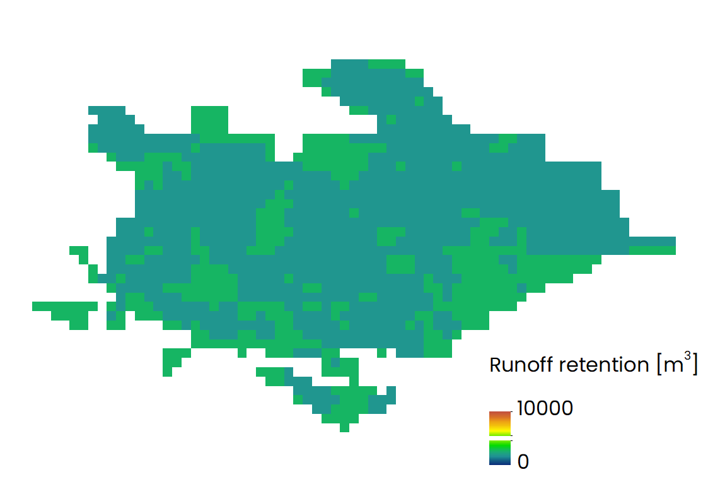 |
|:--:|
| Distribution of runoff rention values when rainfall=30 mm. |

|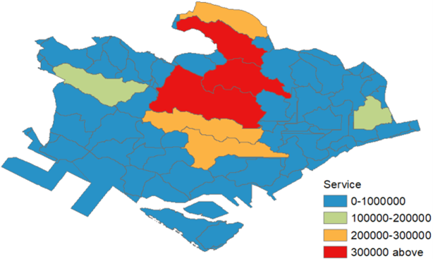 |
|:--:|
| Distribution of service values when rainfall=30 mm. |

Step 3: Rainfall=100 mm  

|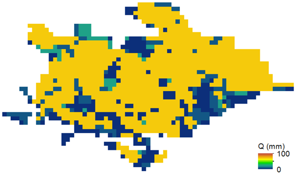 |
|:--:|
| Distribution of runoff values (Q) values when rainfall=100 mm. |

|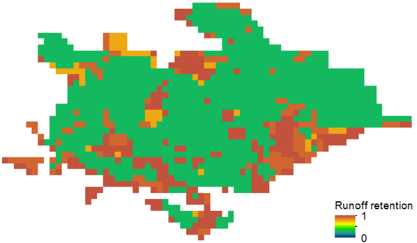 |
|:--:|
| Distribution of runoff rention when rainfall=100 mm. |

|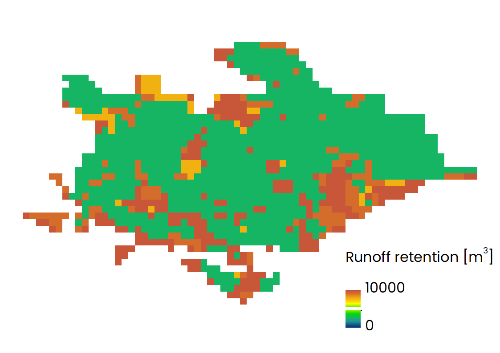 |
|:--:|
| Distribution of runoff rention values when rainfall=100 mm. |

|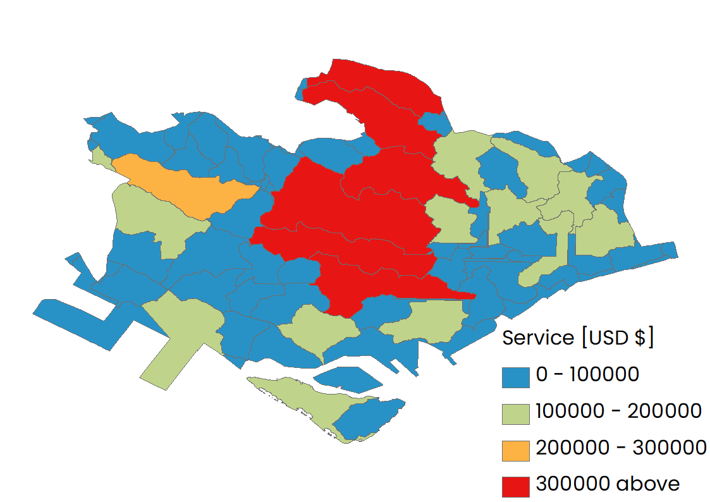 |
|:--:|
| Distribution of service values when rainfall=100 mm. |

Step 4: Rainfall=100 mm and land use change  

|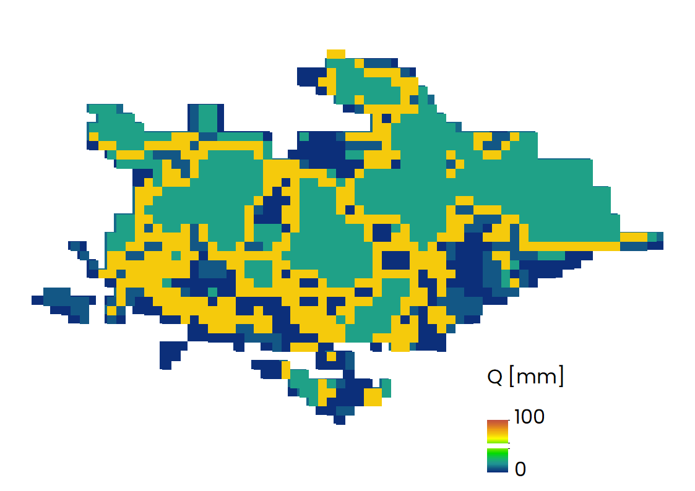 |
|:--:|
| Distribution of runoff values (Q) values when rainfall=100 mm. |

|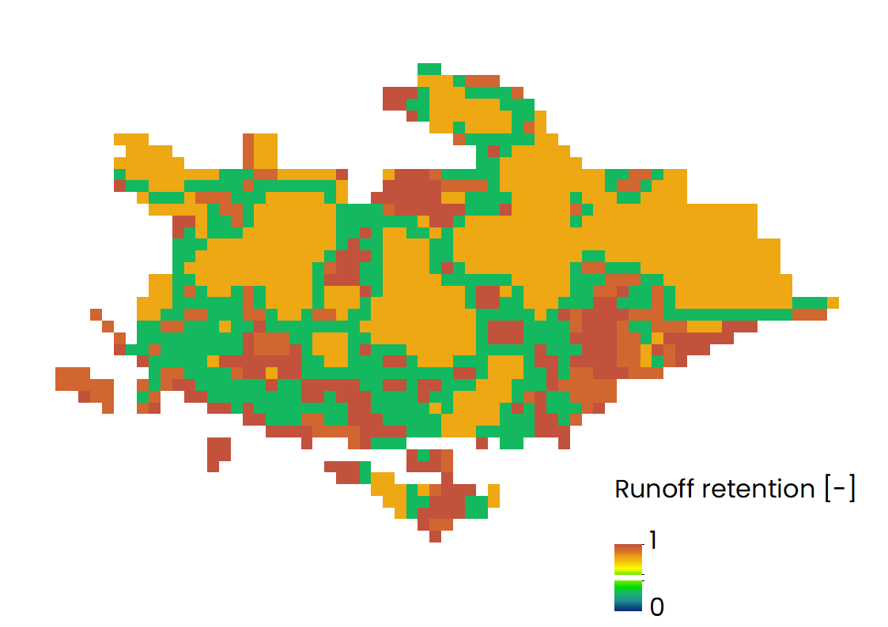 |
|:--:|
| Distribution of runoff rention when rainfall=100 mm and land use change. |

|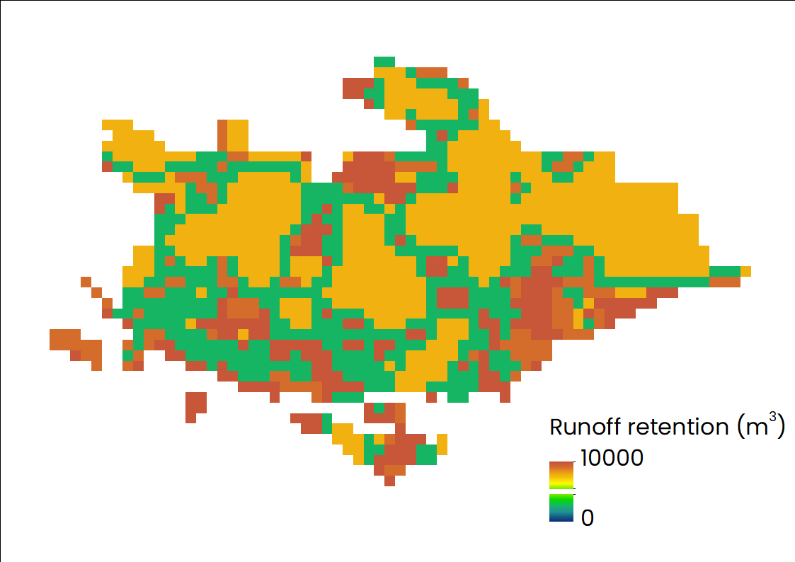 |
|:--:|
| Distribution of runoff rention values when rainfall=100 mm and land use change. |

|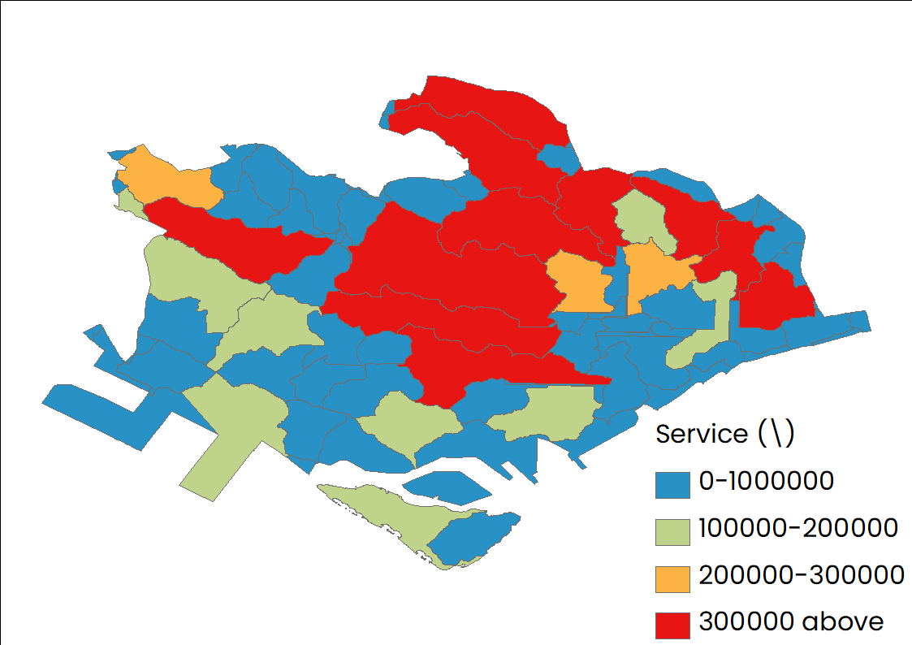 |
|:--:|
| Distribution of service values when rainfall=100 mm and land use change. |

## Existing functions

### Empirical Forest Growth Module

The empirical xxx.

#### Inputs:

- Time Step (Monthly)
- Region
- Forest type
- Rainfall in that region
- Minimum and Maximum Temperature
- [Vapour Pressure Deficit](https://en.wikipedia.org/wiki/Vapour-pressure_deficit)
- [Soil Water Holding Capacity](https://en.wikipedia.org/wiki/Soil_moisture)

#### Outputs:

- Calculated xxx

## Frequently asked questions

1. What’s the type of land use files?  
   Land use/Land cover files should be raster. In addition, all values in this raster must have corresponding entries in the Biophysical Table.

