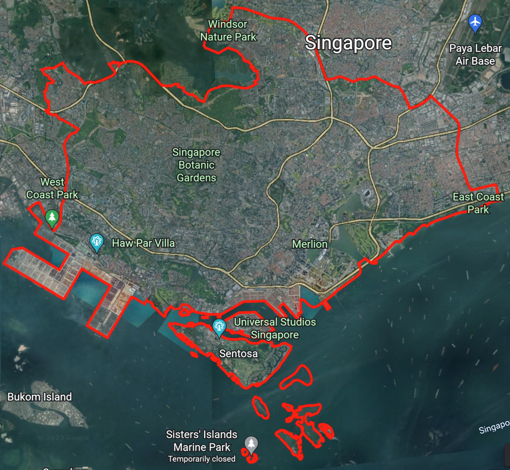
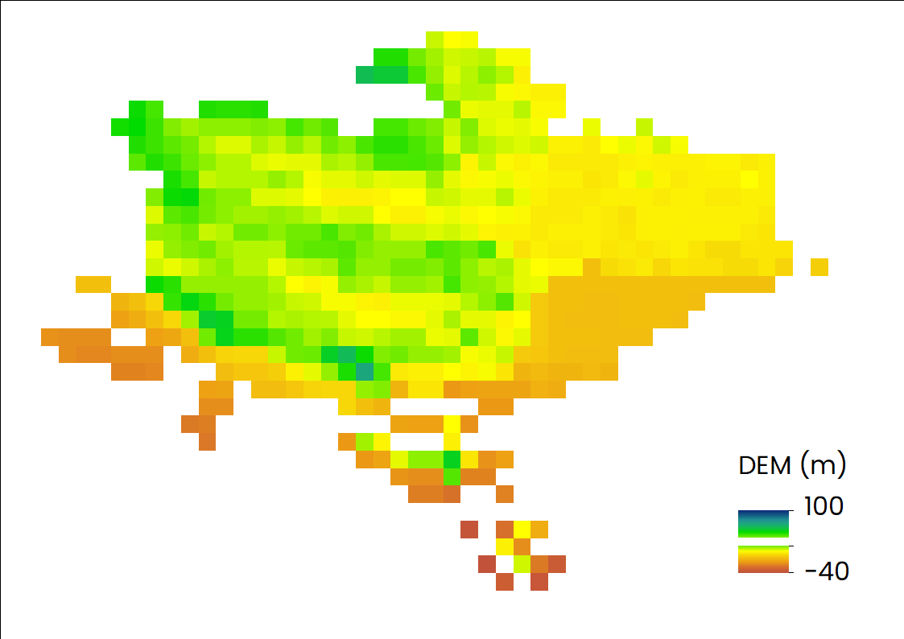
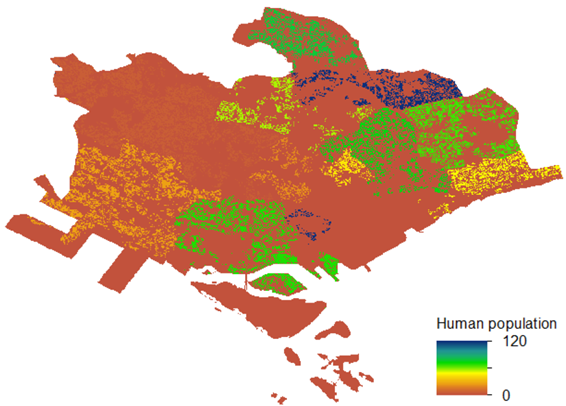
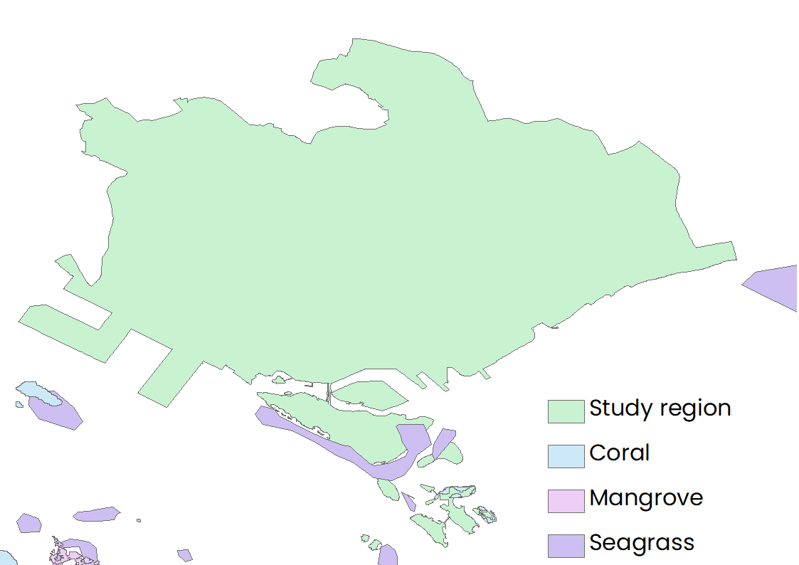
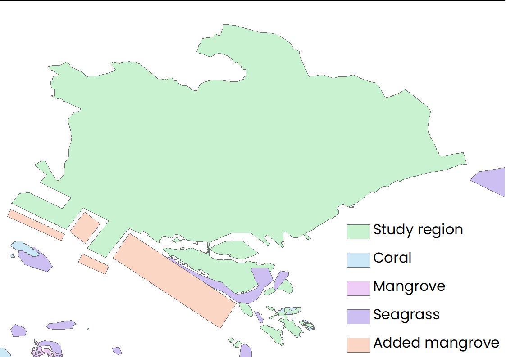
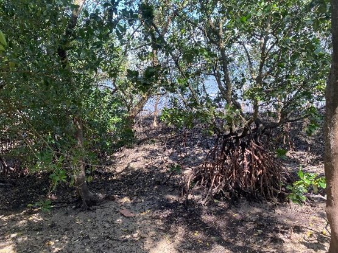
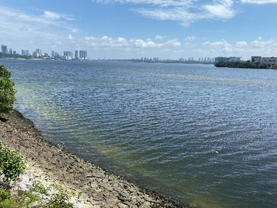
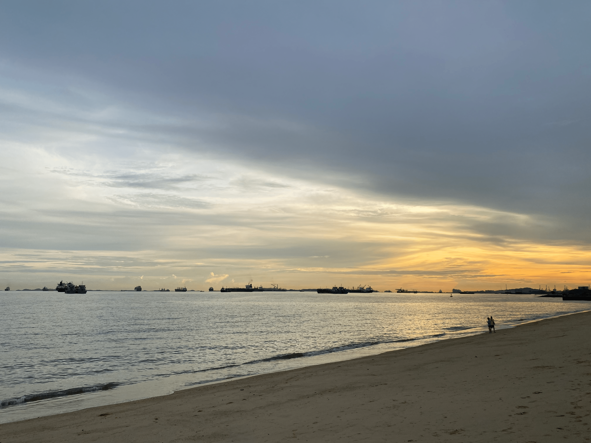

## Key Data

### List

- Workspace: 
- Area of interest: 
- Model resolution (m): 
- Landmass:
- Bathymetry:
- Wavewatcth Ⅲ: 
- Maximum Fetch Distance (m):
- Habitats Table:
- Continental Shelf Contour:
- Digital Elevation Model:
- Elevation Averaging Radius (m):
- Geomorphology (optional):
- Geomorphology Fill Value:
- Human Population (optional):
- Population Search Radius (m):
- Sea Level Rise (optional):
- Sea Level Rise Field:

### Input files
||
|:--:|
| Location of area of interest. |

||
|:--:|
| Distribution of DEM. |

||
|:--:|
| Distribution of human population. |

||
|:--:|
| Distribution of habitats. |

||
|:--:|
| Distribution of new habitats. |

### Other Considerations

- (1) The influences of new added habitats (e.g., mangrove)?  
  In tihs study, the influences of new added habitats have been fully cosidered by comparing the reults of the relative exposure to coastal hazard under original habitats and that under another one new habitats. For example, some mangroves near to the coastal line may reduce the coastal exposure ([Hamza et al., 2022](https://www.mdpi.com/2073-445X/11/10/1714#:~:text=The%20results%20indicate%20that%20the,corals%20and%20seagrasses%20are%20lost.)). The following figure show some mangroves existed in Sungei Buloh Wetland Reserve in Singapore.  

||
|:--:|
| A mangrove is a shrub or tree that grows in coastal saline or brackish water (Some photos showing the mangrove existed in Sungei Buloh Wetland Reserve in Singapore). |  

||
|:--:|
| A mangrove is a shrub or tree that grows in coastal saline or brackish water (Some photos showing the mangrove existed in Sungei Buloh Wetland Reserve in Singapore). |
  
- (2) The influences of sea level rise (SLR)?  
  In tihs study, the influences of sea level rise have been fully cosidered by comparing the reults of the relative exposure to coastal hazard under original sea water level and that under another one new sea water level increased by 6 meters around the region of interest.  

||
|:--:|
|Mean sea level around Singapore is projected to rise by up to 1m by 2100 according to the statistics published by PUB (https://www.pub.gov.sg/).(The left shows the coastal line existed in Sungei Buloh Wetland Reserve while the right shows that existed in East Coast Park in Singapore.)|  

||
|:--:|
| Mean sea level around Singapore is projected to rise by up to 1m by 2100 according to the statistics published by PUB (https://www.pub.gov.sg/).(The left shows the coastal line existed in Sungei Buloh Wetland Reserve while the right shows that existed in East Coast Park in Singapore.)|  
