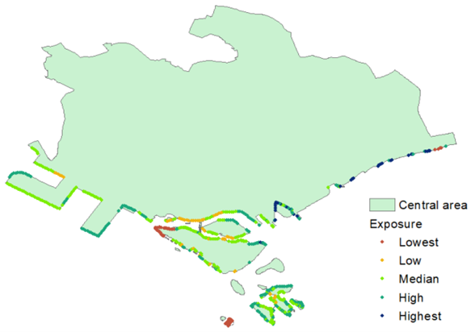
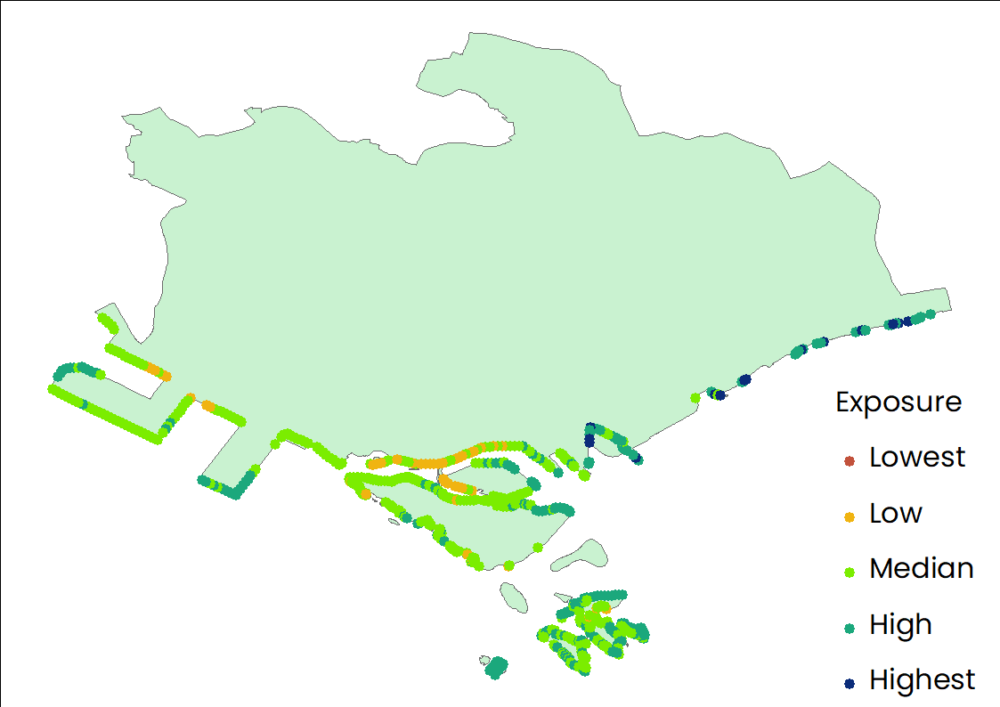
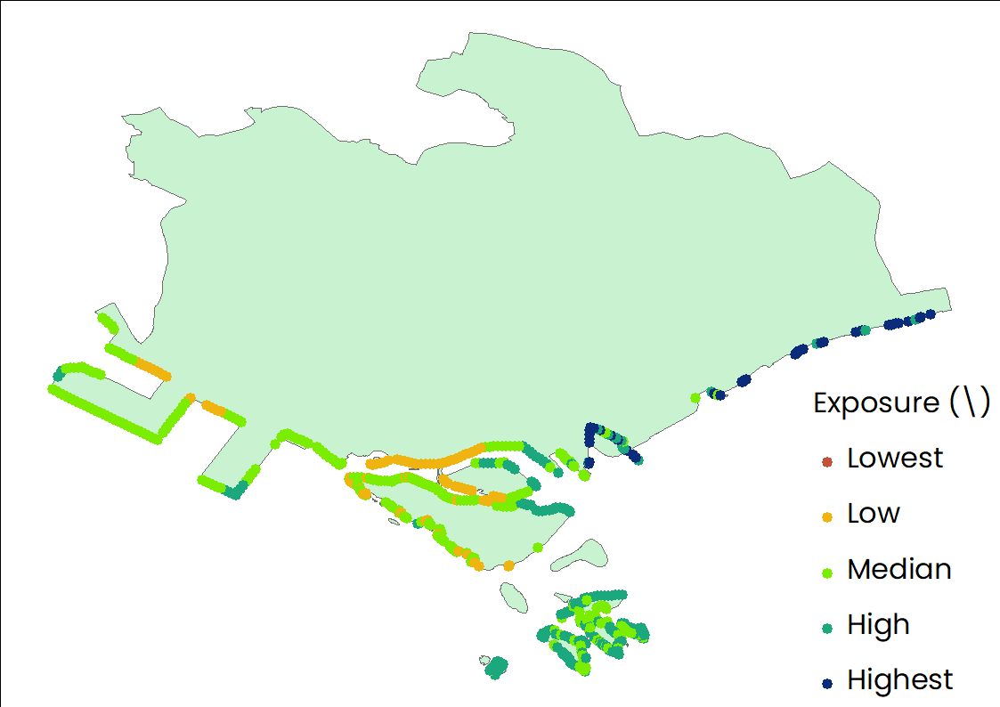

:::info

This page is incomplete and we would love your help. Edit this page and add anything that would be helpful to others.

:::

## Introduction
The InVEST Coastal Vulnerability Model produces a qualitative estimate of such exposure in terms of a vulnerability index, which differentiates areas with relatively high or low exposure to erosion and inundation during storms [(source)](https://invest-userguide.readthedocs.io/en/latest/coastal_vulnerability.html). Urban coastal ecosystems are especially important due to the large populations these limited ecosystems serve [(source)](https://journals.plos.org/plosone/article?id=10.1371/journal.pone.0163495). The purpose of this part is mainly to map coastal vulnerability and explore the role of sea level rise (SLR) and natural habitats played in influencing the relative exposure to coastal hazard.

## Prerequisites

Before running the module of Coastal Vulnerability Model, you need to collect all necessary data, which has been listed in the [part of Data requirement](https://xiaoganghe.github.io/InVEST-Cities-in-Nature/docs/Coastal-Vulnerability/data).

## Contents

1. [How do modules work?](#how-do-modules-work)
2. [Frequently asked questions](#frequently-asked-questions)  

## Model Output Layout

InVEST Coastal Vulnerability Model outputs have the following layout:

```
.
│  coastal_exposure.csv
│  coastal_exposure.gpkg
│  InVEST-natcap.invest.coastal_vulnerability-log-2023-01-27--21_22_44.txt
│
└─intermediate
    │  intermediate_exposure.csv
    │  intermediate_exposure.gpkg
    │
    ├─geomorphology
    │      geomorph.pickle
    │      geomorphology_projected.gpkg
    │      shore_points_missing_geomorphology.gpkg
    │
    ├─habitats
    │      Coral.pickle
    │      habitat_protection.csv
    │      Mangrove.pickle
    │      Seagrass.pickle
    │
    ├─population
    │      clipped_projected_pop.tif
    │      population.pickle
    │      Singpopulation_clipped.tif
    │
    ├─relief
    │      clipped_projected_dem.tif
    │      positive_dem.tif
    │      relief.pickle
    │      singdem1_clipped.tif
    │
    ├─sealevelrise
    ├─shore_points
    │      clipped_projected_landmass.gpkg
    │      landmass_line_index.pickle
    │      landmass_line_rtree.dat
    │      landmass_line_rtree.idx
    │      landmass_polygon.pickle
    │      shore_points.gpkg
    │      tmp_clipped_landmass.gpkg
    │
    ├─surge
    │      surge.pickle
    │
    ├─wind_wave
    │      clipped_projected_bathy.tif
    │      fetch_points.gpkg
    │      fetch_rays.gpkg
    │      gebco_2022_n1.5_s1.0_w103.0_e104.0_clipped.tif
    │      negative_bathymetry.tif
    │      wave.pickle
    │      wave_energies.gpkg
    │      wind.pickle
    │      wwiii_shore_points.gpkg
    │
    └─_taskgraph_working_dir
            taskgraph_data.db
```  

### Structure rundown

- `/coastal_exposure.csv` - File with results in the attribute table   
- `/coastal_exposure.gpkg` - File with results in the attribute table   
- `/InVEST-natcap.invest.coastal_vulnerability-log-2023-01-04--13_36_29.txt` - This is the logfile produced during every run of InVEST  
- `/intermediate/`  
- `/intermediate/intermediate_exposure.csv` - This is an identical copy of the attribute table of coastal_exposure.gpkg provided in csv format for convenience 
- `/intermediate/intermediate_exposure.gpkg` - This point vector contains the same shore points as in coastal_exposure.gpkg, but the attribute table contains the intermediate values of variables before these values were binned into the 1 - 5 ranks     
- `/intermediate/geomorphology/` 
- `/intermediate/geomorphology/geomorph.pickle` 
- `/intermediate/geomorphology/geomorphology_projected.gpkg` 
- `/intermediate/geomorphology/shore_points_missing_geomorphology.gpkg` - This vector stores the shore points that received the geomorphology fill value because no geomorphology segments were found within the search radius of the point 
- `/intermediate/habitats/`
- `/intermediate/habitats/Coral.pickle`
- `/intermediate/habitats/habitat_protection.csv` - This CSV file within the intermediate/habitats subfolder contains results of the habitat layer processing
- `/intermediate/habitats/Mangrove.pickle`
- `/intermediate/habitats/Seagrass.pickle`
- `/intermediate/population/`
- `/intermediate/population/clipped_projected_pop.tif`
- `/intermediate/population/population.pickle`
- `/intermediate/population/Singpopulation_clipped.tif`
- `/intermediate/relief/`
- `/intermediate/relief/clipped_projected_dem.tif`
- `/intermediate/relief/positive_dem.tif`
- `/intermediate/relief/relief.pickle`
- `/intermediate/relief/singdem1_clipped.tif`
- `/intermediate/sealevelrise/`   
- `/intermediate/shore_points/`  
- `/intermediate/shore_points/clipped_projected_landmass.gpkg`  
- `/intermediate/shore_points/landmass_line_index.pickle`  
- `/intermediate/shore_points/landmass_line_rtree.dat` 
- `/intermediate/shore_points/landmass_line_rtree.idx`  
- `/intermediate/shore_points/landmass_polygon.pickle`  
- `/intermediate/shore_points/shore_points.gpkg`  
- `/intermediate/shore_points/tmp_clipped_landmass.gpkg`  
- `/intermediate/surge/`
- `/intermediate/surge/surge.pickle`  
- `/intermediate/wind_wave/`  
- `/intermediate/wind_wave/clipped_projected_bathy.tif`
- `/intermediate/wind_wave/fetch_points.gpkg` - This point vector contains all the shore points  
- `/intermediate/wind_wave/fetch_rays.gpkg` - This line vector represents the rays that were cast in 16 directions around each shore point
- `/intermediate/wind_wave/gebco_2022_n1.5_s1.0_w103.0_e104.0_clipped.tif`  
- `/intermediate/wind_wave/negative_bathymetry.tif`  
- `/intermediate/wind_wave/wave.pickle`
- `/intermediate/wind_wave/wave_energies.gpkg` - This point vector contains all the shore points  
- `/intermediate/wind_wave/wind.pickle`
- `/intermediate/wind_wave/wwiii_shore_points.gpkg`  
- `/intermediate/_taskgraph_working_dir/` - This directory contains a machine-readable database used internally by the model  
- `/intermediate/_taskgraph_working_dir/taskgraph_data.db`  


- Note: More detailed descriptions about the outputs of the InVEST Coastal Vulnerability Model also can refer to this [link](https://storage.googleapis.com/releases.naturalcapitalproject.org/invest-userguide/latest/coastal_vulnerability.html#data-needs).  

### How do modules work?

- Step 1: Running the model using all materials listed in the part of Data requirement.  


- Step 2: The Relative exposure to coastal hazard when no added habitats and without considering sea level rise (hereafter SLR) is presented in this figure. According to this figure, we can find that the relative exposure to coastal hazard varies from point to point. It should be noted that some points with brown denote that the relative exposure of these places are relatively low among all points.    

| |
|:--:|
| The Relative exposure to coastal hazard when no added habitats and without considering SLR. |

- Step 3: The Relative exposure to coastal hazard when no added habitats and considering SLR is presented in this figure. To further explore the role of sea level rise (SLR) played in influencing the relative exposure to coastal hazard, we further compared the coastal vulnerability results from the present scenario and that without considering SLR. It is interesting that some points have transformed into green from brown (shown in previous figure), indicating that the relative exposure of these place to coastal hazard has obviouly increased because of consdiering the role of SLR. 

| |
|:--:|
| The Relative exposure to coastal hazard when no added habitats and considering SLR. |

- Step 4: The Relative exposure to coastal hazard when added habitats and without considering SLR is presented in this figure. To further explore the role of mongrove played in influencing the relative exposure to coastal hazard, we further compared the coastal vulnerability results from the present scenario and that added more mongrove. Contrary to the SLR, the added mongrove can reduce the relative exposure of some places to coastal hazard, which is represented by the reduction of blue points after comparing the results shown in this figure with that shown in Step 2.

| |
|:--:|
| The Relative exposure to coastal hazard when considering added habitats and no SLR. |

- Step 5: The Relative exposure to coastal hazard when added new habitats and considering SLR is presented in this figure.  The added mongrove can reduce the relative exposure of some places to coastal hazard, which has been mentioned in Step 4, while the SLR can greatly increase the relative exposure of some places to coastal hazard. Therefore, the relative exposure to coastal hazard when added new habitats and considering SLR is unknown. To better explore the relative exposure to coastal hazard under different scenarios, we further desigh a new scenario that can show the relative exposure to coastal hazard under the joint effects of SLR and added mangrove. According to this figure, some changes can be observed in few points after comparing the results shown in this figure with that observed in previous steps.

| |
|:--:|
| The Relative exposure to coastal hazard when considering added habitats and considering SLR. |

## Related references  
- Zhang Y, Wu T, Arkema KK, Han B, Lu F, Ruckelshaus M, Ouyang Z. Coastal vulnerability to climate change in China’s Bohai Economic Rim. Environment International. 2021 Feb 1;147:106359. https://doi.org/10.1016/j.envint.2020.106359.  
- Arkema KK, Guannel G, Verutes G, Wood SA, Guerry A, Ruckelshaus M, Kareiva P, Lacayo M, Silver JM. Coastal habitats shield people and property from sea-level rise and storms. Nature climate change. 2013 Oct;3(10):913-8. https://doi.org/10.1038/nclimate1944 
- Caro C, Marques JC, Cunha PP, Teixeira Z. Ecosystem services as a resilience descriptor in habitat risk assessment using the InVEST model. Ecological Indicators. 2020 Aug 1;115:106426. https://doi.org/10.1016/j.ecolind.2020.106426.
