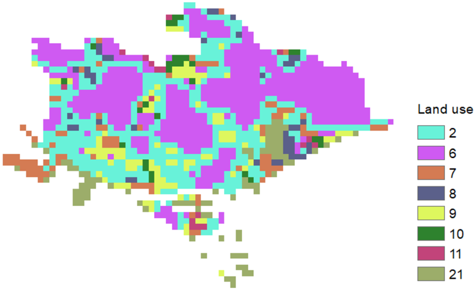
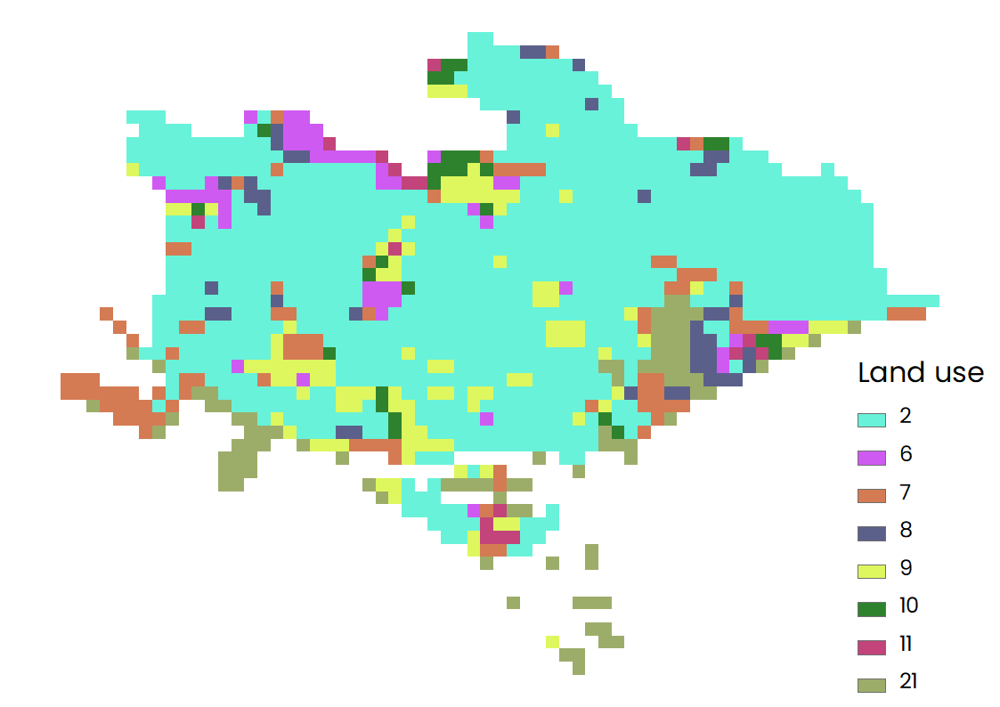

## Key Data

### List
[Download all input data](http://invest-model-input-files.s3-website-ap-southeast-1.amazonaws.com/)
- Workspace:
- Current LULC:
- Carbon pools:
- Calculate Sequestration: Yes
- Future LULC:
- REDD Scenario Analysis (optional): No
- Run Valuation Model (optional): Yes
- Current LULC Year: 2020
- Current LULC Year: 2050
- Price Of Carbon (currency/t): 100
- Annual Market Discount Rate: 0.07
- Annual Price Change: 0.05

### Input files
- In this figure, we can find the distribution of land use at present across the entire study region.  

||
|:--:|
| Distribution of land use at present. |  

- In This figure, we can find the distribution of land use after change across the entire study region. It can be found that most part of the high intensity developed area (ID=2) has been transformed into cultivated land (ID=2) after after comparing this figure with the above one.  

||
|:--:|
| Distribution of land use after change. |  
