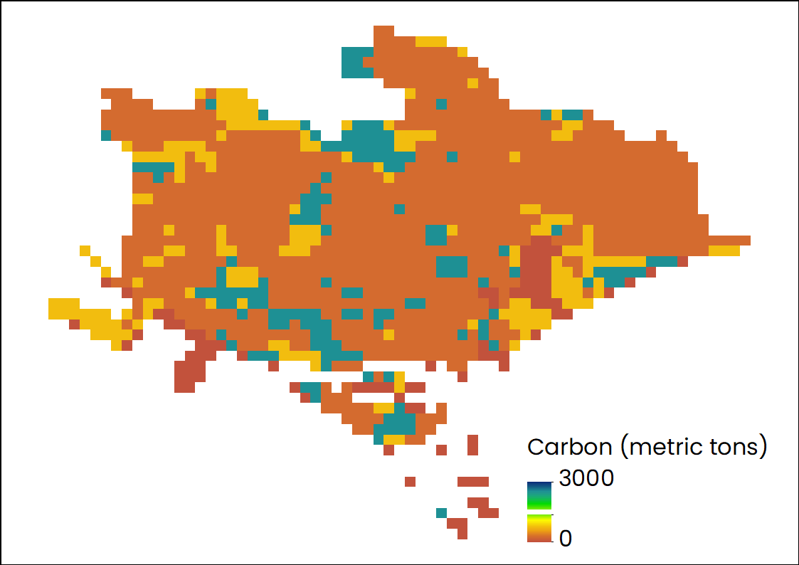
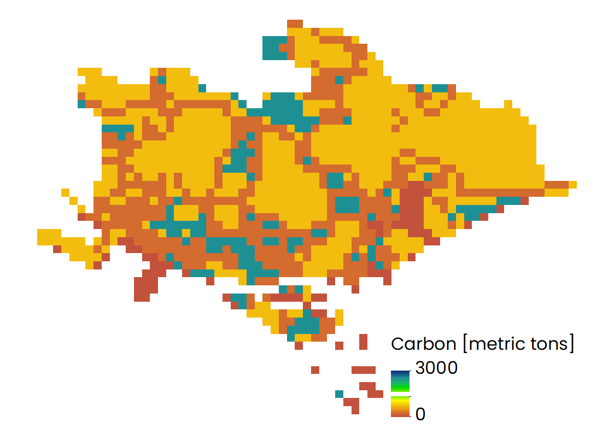
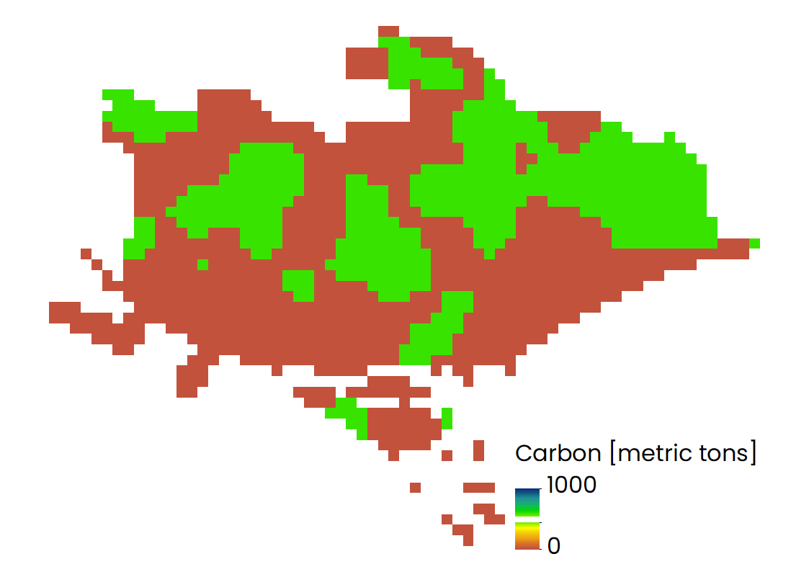
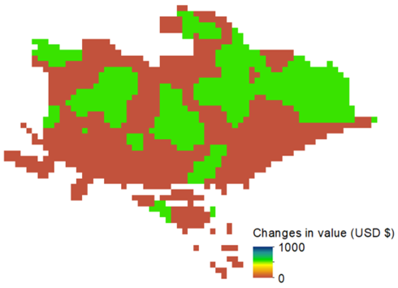

:::info

This page is incomplete and we would love your help. Edit this page and add anything that would be helpful to others.

:::

InVEST is xxx.
## Introduction
The InVEST Carbon Storage and Sequestration model uses maps of land use along with stocks in four carbon pools (aboveground biomass, belowground biomass, soil, and dead organic matter) to estimate the amount of carbon currently stored in a landscape or the amount of carbon sequestered over time([source](https://invest-userguide.readthedocs.io/en/latest/carbonstorage.html)).

## Prerequisites

Before running the module of Carbon Storage and Sequestration model, you need to collect all necessary data, which has been listed in the [part of Data requirement](https://xiaoganghe.github.io/InVEST-Cities-in-Nature/docs/Carbon-Storage-and-Sequestration/about).

## Contents

1. [How do modules work?](#how-do-modules-work)
2. [Empirical forest growth module](#empirical-forest-growth-module)
3. [Frequently asked questions](#frequently-asked-questions)

## How do modules work?

Step 1: Running the model using all materials listed in the part of Data requirement  
 

Step 2: Changes in carbon storage between year 2020 and 2050  

| |
|:--:|
| Distribution of carbon storage when year 2020. |  

| |
|:--:|
| Distribution of carbon storage when year 2050. |

| |
|:--:|
| Changes in carbon storage between year 2020 and 2050. |

| |
|:--:|
| Changes in the vaule of carbon storage between year 2020 and 2050. |

#### Inputs:

- Time Step (Monthly)
- Region
- Forest type
- Rainfall in that region
- Minimum and Maximum Temperature
- [Vapour Pressure Deficit](https://en.wikipedia.org/wiki/Vapour-pressure_deficit)
- Soil Water Holding Capacity

#### Outputs:

- Calculated xxx

## Frequently asked questions

1. What’s carbon pools?  
   It refers to a table that introduces all carbon pool data for each LULC type. More detailed information about this table you can refer to the [User’ Guide of InVEST model](https://storage.googleapis.com/releases.naturalcapitalproject.org/investuserguide/latest/carbonstorage.html#data-needs).

