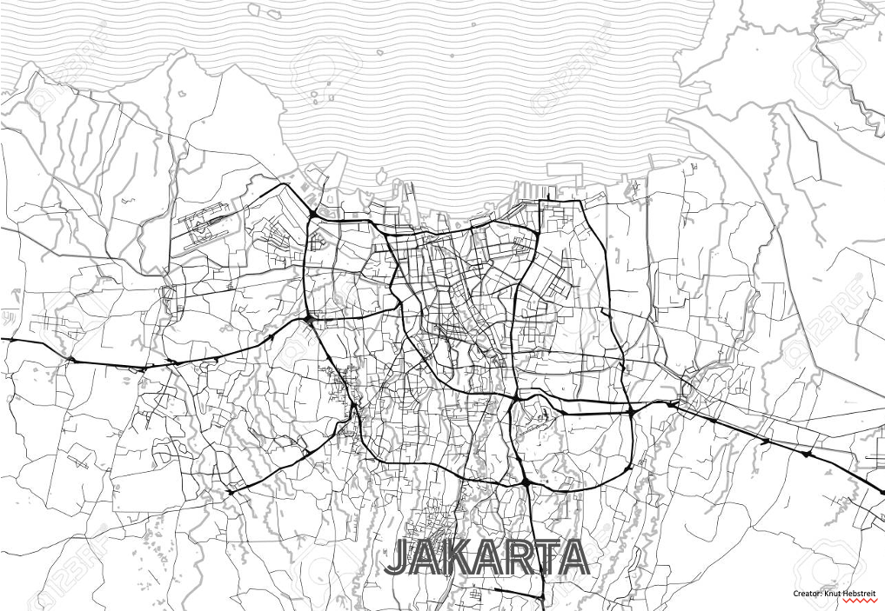

export const Highlight = ({children, color}) => (
  
    {children}
  
);

## Studio Schedules

| Studio #                  | Date         | Week # | Type[^1]                                                   |
| --------------------------| ------------ | -------| -----------------------------------------------------------|
| [Studio 1](./studio-1)    | Jan 29, 2024 | 3      | <Highlight color="rgb(13, 100, 81)">Working 🔍</Highlight> |
| [Studio 2](./studio-2)    | Feb 19, 2024 | 6      | <Highlight color="#0e7490">Presentation 🎤</Highlight>     |
| [Studio 3](./studio-3)    | Mar 11, 2024 | 8      | <Highlight color="rgb(13, 100, 81)">Working 🔍</Highlight>     |
| [Studio 4](./studio-4)    | Apr 1, 2024  | 11     | <Highlight color="#0e7490">Presentation 🎤</Highlight> |
| [Studio 5](./studio-5)    | Apr 15, 2024 | 13     | <Highlight color="#0e7490">Presentation 🎤</Highlight>     |

[^1]: <Highlight color="rgb(13, 100, 81)">Working 🔍</Highlight> studios will be meant for team discussion with SL and TA, and to clarify any questions for the studio project.   <Highlight color="#0e7490">Presentation 🎤</Highlight> studios will be for your team and yourself to present your findings that fulfill the respective deliverables.

## Project Brief

### Role Play
In your pre-assigned groups, you are to self-assign to one of the roles below:

| Role                          | Description |
| ----------------------------- | ----------- |
| Policy maker                  | Individuals in the government who are responsible for developing and amending policies to maximise the well-being of their citizens.     Depending on the level (city, national, etc.) and field of their ministry (health, education etc.), their goals could include ensuring economic growth, maintaining social stability, or improving the lives of certain residential demographics that they represent. Policies can be specific or broad-based depending on the scale, project, and demographic that they are serving.     Examples: Mayors, Ministers |
| Business person                | Leverage on existing and surrounding infrastructure to complement and add value to the development.     Business persons are often driven by private organisational benefits such as increased financial standing and optimising asset values.     Examples: Property Developer, Industralists, Investors |
| Urban professional            | Responsible for developing and designing urban areas that incorporate research and input from numerous stakeholders including citizens, property owners, investors, and government agencies.     Urban professionals can have multiple goals such as improving quality of life, elevating nature, or pedestrianising a city through a planning or design-based lens.     Examples: Urban Planner, Architect, Civil/M&E Engineer |
| Member of the community       | Aim to protect and represent the interests of specific communities and advocate for adequate representation. This may include petitioning for the conservation of specific sites, protecting the environment from overdevelopment, advocating for more culture and heritage preservation, or asking for more social spaces to be developed as opposed to commercial centres.     Members of the community often seek transparency in decision-making processes as these translates to developments and regulations that directly affect their neighbourhoods and livelihoods. |
| Non-Governmental organisation | Non-profit entities that work to work towards public or social changes.     These organisations are essential in developing the society and improve community engagement. They can be funded by grants or general donations.     There are often different categories of NGOs: Community-based, City-wide based, National, and International. |
| Environmental activist        | Individuals who actively seeks to protect and care for the environment. They are concerned about all issues affecting the natural world of land, sea, air, plants, and animals. |

With the different roles, your team is required to study the allocated district using the topics taught within the two different themes:

- `Climate Resilience`
- `Use of Limited Resources` 

Overall, the studio projects aim to apply an urban systems approach to define the urban problem(s) of cities that fall within the category of “Sustainable Environment” of the Liveability Framework and find integrated urban solution(s) that minimise environmental impacts while improving the liveability of the cities. 

This will be a team effort and each member will role-play as different types of stakeholders to bring different perspectives in understanding the site problem(s) and agreeing on the solution(s). The challenge of the collaborative process will be to resolve competing interests between stakeholders and weighing trade-offs. You will be allocated to one of the two districts: [Central Area](#central-area) and [Queenstown](#queenstown) plus the City of Jakarta.

### Studio Objectives
- Understand the current approaches that Singapore is taking to address issues about sustainable environment.
- Understand that national- or urban-level directions, agendas and programmes affect the city at the lower levels of organisation, such as the district-level.
- Understand how the nature of the problem a district or a city faces involves multiple stakeholders and multiple urban systems. 
- Understand that the crafting of urban solutions needs to be based on a robust understanding of the nature of the urban problems they are responding to, and an understanding of the impact of the proposed solutions on multiple stakeholders to minimise the impact of stakeholder trade-offs.
- Understand the tools that can be used to evaluate the effectiveness of proposed solution(s), including InVEST models.
- Understand that some approaches that each city takes cannot be translated to the contexts of other cities, because they do not operate well within a different context.

### District

#### Central Area
Home to a number of ethnic enclaves and neighbourhoods, Central Area is a distinct, cultural core that boasts a diverse range of enduring heritage areas. Originally a kampong, Chinatown housed many immigrants due to its proximity to the Singapore River. Today, it is Singapore’s largest District with four sub-districts. 

Kampong Glam, a former fishing village, saw the Istana Kampong Glam built by Sultan Hussain Mohammed Shah and maintains Malay-Arab influence today with the Sultan Mosque being designated as a national monument in 1975. Little India was the second settling point for Indian immigrants after the Chulia Kampong area became overcrowded and transformed into a bustling economic and activity hub. Other areas such as Golden Mile Complex and Peninsula Plaza host Thai and Burmese populations respectively.

:::tip
Refer to the Central Area District Guide on [Canvas](https://canvas.nus.edu.sg/courses/52842/files/3308649?module_item_id=289582) for more information.
:::

#### Queenstown
Named after Queen Elizabeth II to mark her coronation in 1952, Queenstown was originally a swampy valley with two hills that evenutally became Singapore’s first satellite town. Initiated by the Singapore Investment Trust (SIT) in the 1950s, the area underwent significant development in the 1960s by the Housing and Development Board (HDB) as part of HDB’s first Five Year Building Programme.

Being a self-sufficient housing estate, Queenstown boasts a myriad of social, commercial, and economic infrastructure including many ‘firsts’ of Singapore. Among these are Queenstown Public Library, Queenstown Polyclinic, and Queenstown Sports Complex.

As the oldest HDB town, the area underwent development again launched through the Development Guide Plan and Selective Enbloc Redevelopment Scheme that sought to rejuvenate the area and appeal to a dynamic and younger generation of residents.

:::tip
Refer to the Queenstown District Guide on [Canvas](https://canvas.nus.edu.sg/courses/52842/files/3308645?module_item_id=289581) for more information.
:::

#### City of Jakarta

### Studio Brief
- With a clear understanding of the allocated district, identify problem(s) that your team would like to improve on to make the district a district in nature. 
- Problems should be within the category of the “Sustainable Environment” of the Liveability Framework. 
- Propose solution(s) in the form of policies, plans and/or programmes to the identified problem(s). 
- Solutions should attempt to minimise environmental impacts while improving liveability of the district. 
- Conduct detailed analysis and evaluation of the proposed solution(s) using a predictive model - InVEST and discuss possible benefit(s) and/or tradeoff(s). You are to use at least `2 InVEST models` (see model list [here](/docs/invest-intro)) to aid your analysis and evaluation. 

### Guiding Questions
Here are some guiding questions for you to consider when developing your problem statement/research question: 
+ With climate change becoming an important issue, how could we do our part to limit global temperature rise?
+ One of the key targets of the Green Plan 2030 is to plant 1 million more trees. How would this affect us? 
+ How could we reduce the amount of carbon dioxide to limit global warming?
+ Being an island, Singapore is vulnerable to the rising sea level. How could we minimise the rate of rise and help coals thrive again?
+ How can we protect our coasts?
+ With the risk of extreme events like flooding, how could we think long term and plan ahead to mitigate such possible occurrences?
+ How do we work towards zero waste?
+ How do we further enhance continuity of water supply?

## Scoring Rubric

<table>
<thead>
  <tr>
    <th rowspan="2"></th>
    <th>Individual grading</th>
    <th colspan="2">Team grading</th>
  </tr>
  <tr>
    <th>Participation</th>
    <th>Meeting studio deliverables</th>
    <th>Presentation</th>
  </tr>
</thead>
<tbody>
  <tr>
    <td>I (Inadequate)</td>
    <td>Is absent without valid reasons; does no participate in team presentations at all</td>
    <td>Does not meet studio deliverables and is unclear about presentation outline.</td>
    <td>Unprepared with no or minimal slides and are unable to present ideas. Fails to display any understanding of module materials.</td>
  </tr>
  <tr>
    <td>B (Beginning)</td>
    <td>Presents minimal portions of the presentation and display little knowlede on the content</td>
    <td>Does not meet studio deliverables.</td>
    <td>Communication aids are poorly prepared. Slides contain errors and lack logical progression.</td>
  </tr>
  <tr>
    <td>D (Developing)</td>
    <td>Generallv disolavs positive attitude.Presents a portion ot the presentation with some displav of knowledge on the team's content</td>
    <td>Demonstrates a limited ability in meeting studio deliverables with.</td>
    <td>Slides are helpful in telling the story with a few glaring problems. Slides are somewhat coherent.</td>
  </tr>
  <tr>
    <td>A (Accomplished)</td>
    <td>Disolavs confidence and positive attitude during the presentation. Presents and displays knowledge of substantial portions ot the team's content.</td>
    <td>Attempts to fulfil all studio deliverables set.</td>
    <td>Slides are error-free and logically present the main components of the process and recommendations. Material is mostly readable and graphics reiterate the main ideas.</td>
  </tr>
  <tr>
    <td>E (Exemplary)</td>
    <td>Naturally leads the team in the presentations and displays full knowledge of the content presented. Presents with confidence and effectively uses presentation materials to engage with the audience.</td>
    <td>Fulfills all studio deliverables.</td>
    <td>Clearly outlined presentation with appropriate and easily understood visual aids. Includes communication aids that enhance the presentation.</td>
  </tr>
  <tr>
    <td>P (Phenomenal)</td>
    <td>Exceeds expectations in presentation skills. knowledge on the content and insights.</td>
    <td>They go beyond expectated studio deliverables to provide a comprehensive view of the thought processes and  proposal decisions.</td>
    <td>Clear and engaging presentation with effective use of visual aids. Exceeds expectations in confidence and clarity when presentating and responding to queries.</td>
  </tr>
</tbody>
</table>
